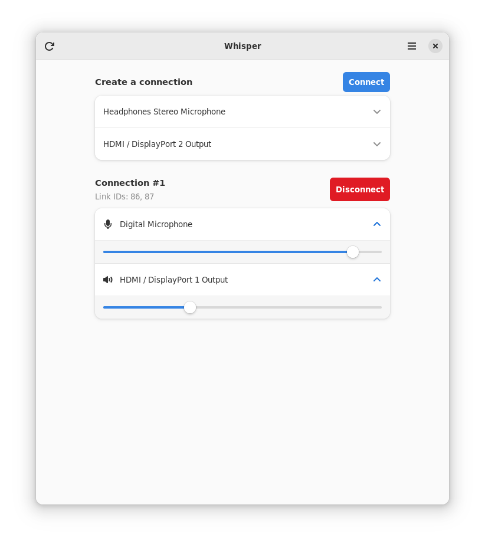
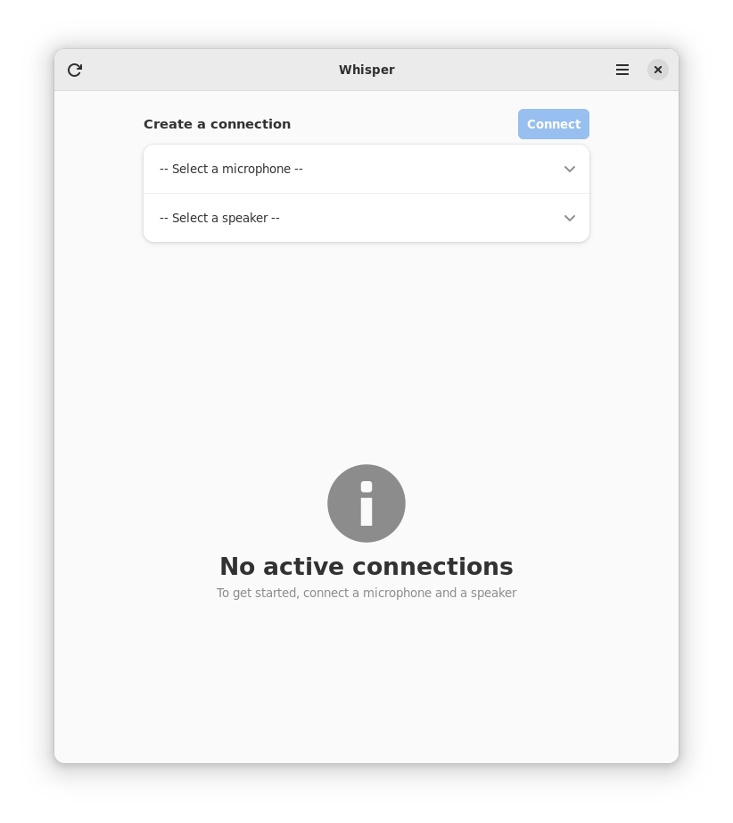
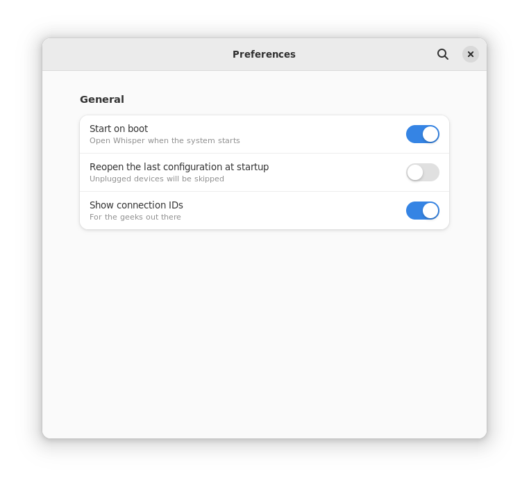

# Whisper - Listen to your microhpone

<p align="center">

</p>

Whisper allows you to listen to your microphone through your speakers. It's useful for testing your microphone or for listening to your voice.

This app requires both PulseAudio and Pipewire to be installed on your system.

Pirewire is available as the default audio server on 
- Fedora 34 and later
- Ubuntu 22.04 and later


## Installation

```bash
flatpak kill it.mijorus.smile
flatpak-builder build/ it.mijorus.whisper.json --user --install --force-clean
```

## Building

Whisper can be built with Flatpak Builder

## Credits

- Icon: Jakub Steiner (jimmac)

## Similar apps

- [Helvum](https://gitlab.freedesktop.org/pipewire/helvum)
- [qpwgraph](https://flathub.org/apps/details/org.rncbc.qpwgraph)

## Screenshots

<p align="center">

</p>
<p align="center">

</p>
<p align="center">

</p>
