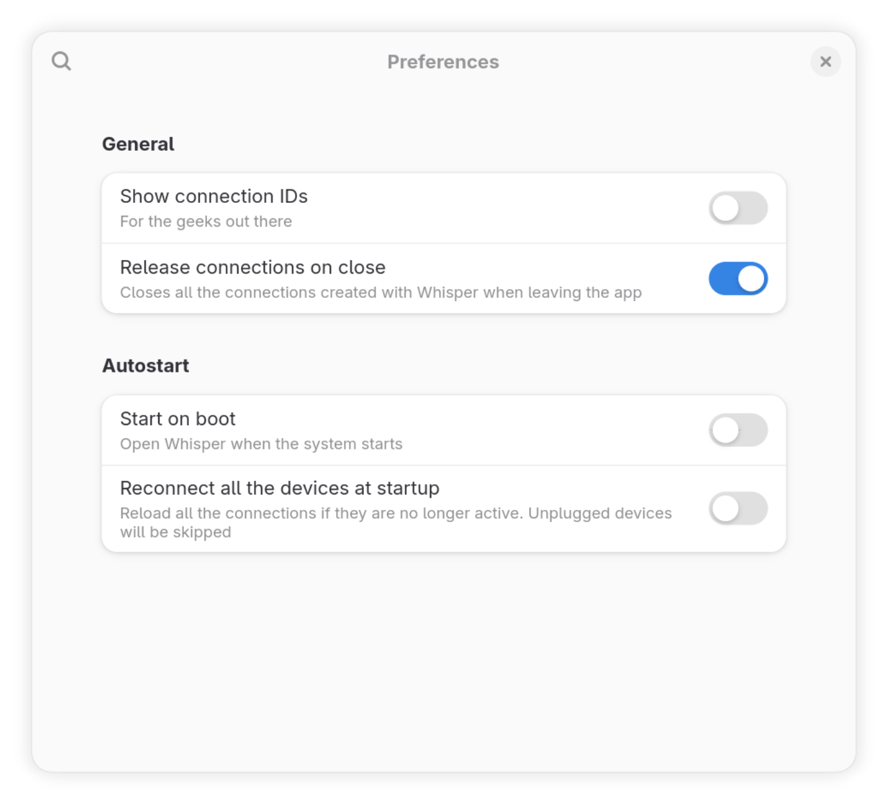
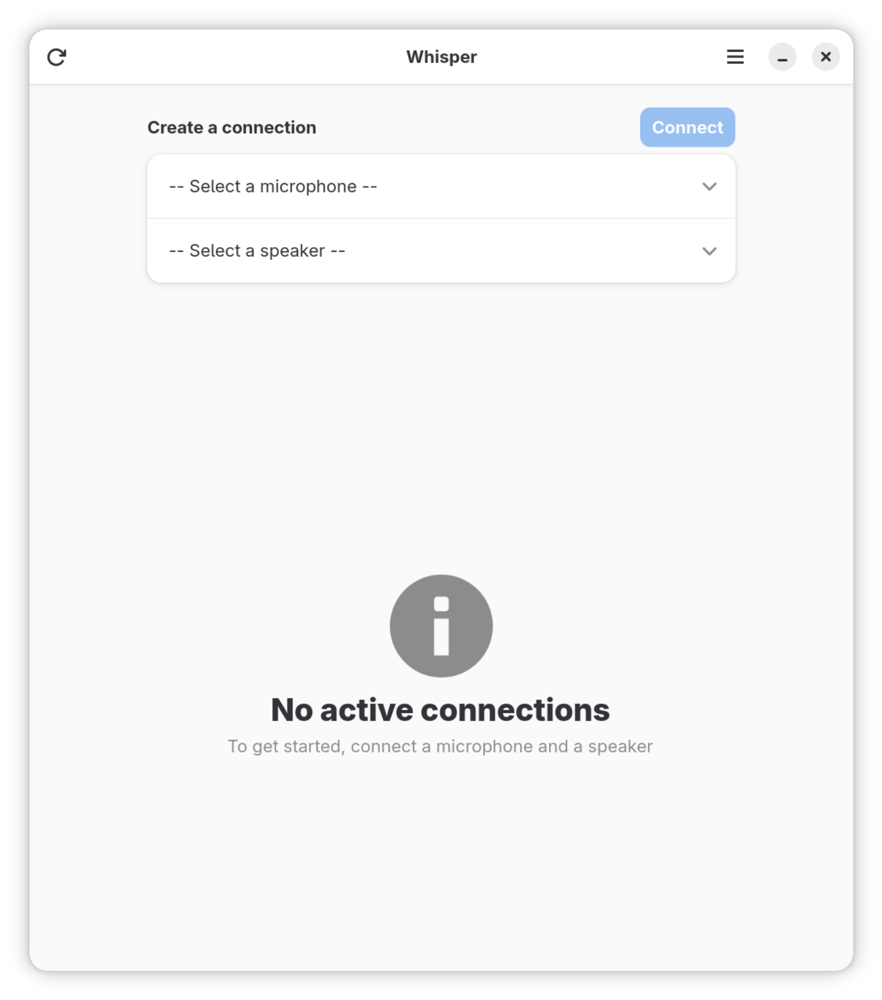

# Whisper - Listen to your microphone

<p align="center">

</p>

<p align="center">
<a href="https://ko-fi.com/mijorus" align="center">
  
</a>
</p>

Whisper allows you to listen to your microphone through your speakers. It's useful for testing your microphone or for listening to your voice.

This app requires both PulseAudio and Pipewire to be installed on your system.

Pirewire is available as the default audio server on 
- Fedora 34 and later
- Ubuntu 22.04 and later

## "Low-latency" mode
> **NOTE**
>
> Enabling low-latency mode may cause audio "pops" if your system is too busy.<br>
> These pops will be recorded in any app which may be using the same microphone at the same time.<br>
> For this reason, **low-latency mode will be deactivated when you close Whisper**, regarding of your settings.

Starting from v1.3.0, a new "low-latency" mode was added.
This option forces a smaller buffer size for a specific device to reduce latency, at the expense of CPU usage and, potencially, audio quality.

By default, if supported by the system, Whisper tries to force a buffer size of 64, but it can rise it up if this value is too small for your system, according to the `default.clock.min-quantum` value specified in your Pipewire configuration.

If you have no idea of what is means, here is a simple explanation:

>  Your computer records audio every specific amount of time, usually 44100 or 48000 times per second. Then, it needs to do convert audio into a digital form. The buffer-size is a value which specifies how much time your computer has, in terms of samples, to process the audio. 
>
> If we set a buffer size of 64 and your system is taking samples every 1/48000 of a second, it means that our system has, at max, (64/48000) 1.3ms of time to process the audio; after that the audio sample will be dropped and we will hear some "popping" sound.

## Installation
<a href="https://flathub.org/apps/details/it.mijorus.whisper" align="center">
  
</a>

___

```bash
flatpak kill it.mijorus.smile
flatpak-builder build/ it.mijorus.whisper.json --user --install --force-clean
```

## Building

Whisper can be built with Flatpak Builder

## Source
<a href="https://github.com/mijorus/whisper" align="center">
  
</a>

## Credits

- Icon: Jakub Steiner (jimmac)

## Similar apps

- [Helvum](https://gitlab.freedesktop.org/pipewire/helvum)
- [qpwgraph](https://flathub.org/apps/details/org.rncbc.qpwgraph)

## Under the hood
This app does more or less the same thing as Helvum does, but with a simple UI: when you have more than a couple of apps playing audio, it gets quite hard to use Helvum.

Furthermore, Whisper shows only physical inputs, while the afroamentioned show all inputs, including audio streams created by apps and virtual ones.

Whisper can also control the microphone gain and the speaker volume.

## Screenshots

<p align="center">

</p>
<p align="center">

</p>
